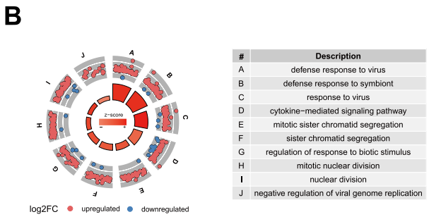

# Installation of packagages if neccessary
```{r Package Installation, message = FALSE, warning = FALSE}
if(!requireNamespace('htmltools', quietly = TRUE))
  install.packages('htmltools')


if(!requireNamespace('colorRamp2', quietly = TRUE))
  install.packages('colorRamp2')


if (!requireNamespace("BiocManager", quietly = TRUE)){
  install.packages("BiocManager")}


if(!requireNamespace('dplyr', quietly = TRUE))
  tidyr::install("dplyr")


if(!requireNamespace("kableExtra", quietly = TRUE))
  install.packages("kableExtra")


if(!requireNamespace("limma", quietly = TRUE))
    BiocManager::install("limma")

if(!requireNamespace('edgeR', quietly = TRUE))
  install.packages('edgeR')


if(!requireNamespace('ggplot2', quietly = TRUE))
  install.packages('ggplot2')

if(!requireNamespace('ggpubr', quietly = TRUE))
  install.packages('ggpubr')

if(!requireNamespace('ggrepel', quietly = TRUE))
  install.packages('ggrepel')

if (!requireNamespace("gprofiler2", quietly = TRUE)){
  install.packages("gprofiler2")}

library(htmltools)
library(colorRamp2)
library(circlize)
library(dplyr)
library(knitr)
library(kableExtra)
library(ComplexHeatmap)
library(edgeR)
library(gprofiler2)
library(ggplot2)
library(ggpubr)
library(ggrepel)
```

Citation (packages): [@1], [@2], [@3], [@4], [@5], [@6],[@7],[@8],[@9],[@10],[@11],[@12]

# Introduction

The dataset[@hu_2023_monocyte] I will be focusing on is on adult-onset Still's disease (AOSD) which is a rare autoinflammatory disease. The most serious symptom resulting from AOSD is macrophage activation syndrome (MAS). To date, there is limited research on AOSD patients with MAS and biomarkers that could be used to detect it. Thus, the study[@jia_2023_neutrophil] aims to contribute to this research area by comparing healthy controls to AOSD patients and AOSD patients with MAS (AOSD-MAS). The dataset used is GSE247993 which was downloaded from GEO. In assignment 1, this dataset was first filtered to remove genes with low reads in which 74% of the genes survived (12404 were kept and 4280 were removed from the count data). The dataset was then normalized using TMM normalization using the edgeR package. 

In this assignment, I will be investigating the differential expression between the three disease states: healthy control, AOSD and AOSD-MAS. Then, I will be conducting an over-representation analysis to see which pathways and terms are enriched. Finally, I will compare the results to those found in the paper. 


# Loading and normalizing count data
Load filtered read count data from assignment 1
```{r message = FALSE, warning = FALSE}
load("filtered_count_mat.RData") #load in filtered read count data, which has not been normalized
```

Normalize the data
```{r message = FALSE, warning = FALSE}
#Create an edgeR container for RNASeq count data
disease_state_1 = c(rep("Healthy Control",10),rep("AOSD",3),rep("AOSD-MAS",9)) #these are the disease states for each column in filtered_count_mat which a patient each. This will be parsed into the DGEList function below
TMM = DGEList(counts = filtered_count_mat, group=disease_state_1) # set group to conditions so DGE can calculate means across groups
d1 = calcNormFactors(TMM) #calculate normalization factors
TMM_norm_counts <- cpm(TMM) #normalize the counts
```

# Part 1. Differential Gene Expression

To define my model design I will revisit my MDS plot from Assignment 1
```{r, fig.cap = "Figure 1. Multidimensional scaling plot by disease state. The disease states are AOSD, AOSD-MAS and healthy control. ", message = FALSE, warning = FALSE}
#Use the limma package to plot MDS of all samples/patients
limma::plotMDS(d1, labels=NULL, pch = 1,
               col = c("darkgreen","red","blue")[factor(disease_state_1)])
legend("topright",
       legend=levels(factor(disease_state_1)),
       pch=c(1), col = c("darkgreen","red","blue"),title = "Disease state", bty = 'n', cex = 0.75)
```
As shown in Figure 1, there is some sort of separation between the healthy control (blue) and the AOSD patients including those with MAS progression (green and red, respectively). There is some separation as well between the AOSD-MAS (red) patients and the AOSD patients (green), with some overlap on the right side of the graph. 

## 1.1 Model design
From the MDS plot I will chose to use two model designs: 1) only healthy control and AOSD-MAS samples 2) only healthy control and AOSD samples
```{r message = FALSE, warning = FALSE}

#Generate a model matrix to design the model for AOSD-MAS vs healthy control
dis_state_AOSDMAS <- c(rep("Healthy Control",10),rep("AOSD-MAS",9))
model_design_AOSDMAS <- model.matrix(~dis_state_AOSDMAS) 

#Repeat the above but with the AOSD and healthy control samples
dis_state_AOSD <-  c(rep("Healthy Control",10),rep("AOSD",3))
model_design_AOSD <- model.matrix(~dis_state_AOSD) 

#Visual check of the model designs
kable(model_design_AOSDMAS, caption = 'Table 1. Model design for healthy control vs. AOSD-MAS patients' )  %>% kable_styling(bootstrap_options = c("striped", "hover", "condensed", "responsive"))
kable(model_design_AOSD, caption = 'Table 2. Model design for healthy control vs. AOSD patients')  %>% kable_styling(bootstrap_options = c("striped", "hover", "condensed", "responsive"))

```

Estimate Dispersion
```{r message = FALSE, warning = FALSE}
d1 <- estimateDisp(TMM[, -c(11:13)], model_design_AOSDMAS) #estimate dispersion for model_design_AOSDMAS. Columns 1-10 + 14-22 in TMM (the normalized table of counts)
d2 <- estimateDisp(TMM[, -(14:22)], model_design_AOSD) #estimate dispersion for model_design_AOSD. Columns 1-10 + 14-22 in TMM (the normalized table of counts)
```
Fit the models
```{r message = FALSE, warning = FALSE}
#Generate fits for model_design_AOSDMAS and model_design_AOSD which are stored in 'fit1' and 'fit2', respectively
fit1 <- glmQLFit(d1, model_design_AOSDMAS) 
fit2 <- glmQLFit(d2, model_design_AOSD)
```
Calculate differential expression using the Quasi likelihood model
```{r message = FALSE, warning = FALSE}
#p-value correction was made using the Benjamini and Hochberg procedure which is the default for the `glmQLFTest function`

#calculate differential expression between healthy control and AOSD-MAS using glmQLFTest
qlf.ctrl_vs_AOSDMAS <- glmQLFTest(fit1, coef = ncol(model_design_AOSDMAS))

#calculate differential expression between healthy control and AOSD using glmQLFTest
qlf.ctrl_vs_AOSD <- glmQLFTest(fit2, coef = ncol(model_design_AOSD))
```
Get all the results, sorted by p-value
```{r message = FALSE, warning = FALSE}
#sort the above results by p-value
qlf_output_hits_AOSDMAS <- topTags <- topTags(qlf.ctrl_vs_AOSDMAS, sort.by = "PValue", n = nrow(TMM_norm_counts))
qlf_output_hits_AOSD <- topTags <- topTags(qlf.ctrl_vs_AOSD, sort.by = "PValue", n = nrow(TMM_norm_counts))
```

## P-values for genes and multiple hypothesis testing

```{r message = FALSE, warning = FALSE}
#How many gene pass the threshold p-value < 0.05?
pval_passed_AOSDMAS <- length(which(qlf_output_hits_AOSDMAS$table$PValue < 0.05))
pval_passed_AOSD <- length(which(qlf_output_hits_AOSD$table$PValue < 0.05))
#how many genes passed FDR correction
FDR_passed_AOSDMAS <- length(which(qlf_output_hits_AOSDMAS$table$FDR < 0.05))
FDR_passed_AOSD <- length(which(qlf_output_hits_AOSD$table$FDR < 0.05))
```

I chose to use p-value < 0.05 as the threshold as it is typically defined as the significance threshold and it is also what is used by the authors in the paper. For the p-value correction I chose the Benjamini and Hochberg (BH) method as opposed to the Bonferroni method because the BH method has more power over the bonferroni method due to the large dataset and the fact that th BH method is less stringent than the Bonferroni method. [@false]

For the AOSD-MAS comparison to healthy control, there were `r pval_passed_AOSDMAS` which passed the p-value threshold and `r FDR_passed_AOSDMAS` which passed after FDR correction. Then, for the AOSD comparison to healthy control, there were `r pval_passed_AOSD` which passed the p-value threshold and `r FDR_passed_AOSD` which passed after FDR correction.

## 1.2 Volcano plot: Amount of differentially expressed genes
Generate a volcano plot for the healthy control and AOSD-MAS patients
```{r message = FALSE, warning = FALSE}
#Make a volcano plot for healthy control vs AOSD-MAS comparison
output_hits_AOSDMAS_df <- as.data.frame(qlf_output_hits_AOSDMAS)

## 1. Add a column to matrix_for_volc called "Differentially_Expressed" to specify if they are up or down regulated
output_hits_AOSDMAS_df$Differentially_Expressed <- "No change" #Set the default to 'No change'
#if logFC > 1 and FDR < 0.05, set as "Up-regulated"
output_hits_AOSDMAS_df$Differentially_Expressed[output_hits_AOSDMAS_df$logFC > 1 & output_hits_AOSDMAS_df$FDR < 0.05] <- "Up-regulated"
#if logFC <-1 and FDR < 0.05, set as "Down-regulated"
output_hits_AOSDMAS_df$Differentially_Expressed[output_hits_AOSDMAS_df$logFC < -1 & output_hits_AOSDMAS_df$FDR < 0.05] <- "Down-regulated"

## 2. Start making a volcano plot
p <- ggplot(data=as.data.frame(output_hits_AOSDMAS_df), aes(x=logFC, y=-log10(FDR), col=Differentially_Expressed)) + geom_point() + theme_minimal()
p2 <- p + geom_vline(xintercept=c(-1, 1), col="blue") +
    geom_hline(yintercept=-log10(0.05), col="red")
p3 <- p2 + scale_color_manual(values=c("blue","grey","red"))

# 3. Assign the colours for downregulated genes, upregulated genes and insignificant genes
mycolors <- c("blue", "red", "grey")
names(mycolors) <- c("Down-regulated", "Up-regulated", "No change")
p3 <- p2 + scale_colour_manual(values = mycolors)

```

Generate a volcano plot for the healthy control and AOSD patients
```{r message = FALSE, warning = FALSE}
#Make a volcano plot for healthy control vs AOSD-MAS comparison
output_hits_AOSD_df <- as.data.frame(qlf_output_hits_AOSD)
## 1. Add a column to matrix_for_volc called "Differentially_Expressed" to specify if they are up or down regulated
output_hits_AOSD_df$Differentially_Expressed <- "No change"
#if logFC > 1 and FDR < 0.05, set as "Up-regulated"
output_hits_AOSD_df$Differentially_Expressed[output_hits_AOSD_df$logFC > 1 & output_hits_AOSD_df$FDR < 0.05] <- "Up-regulated"
#if logFC <-1 and FDR < 0.05, set as "Down-regulated"
output_hits_AOSD_df$Differentially_Expressed[output_hits_AOSD_df$logFC < -1 & output_hits_AOSD_df$FDR < 0.05] <- "Down-regulated"

## 2. Start making a volcano plot
p4 <- ggplot(data=as.data.frame(output_hits_AOSD_df), aes(x=logFC, y=-log10(FDR), col=Differentially_Expressed)) + geom_point() + theme_minimal()
p5 <- p4 + geom_vline(xintercept=c(-1, 1), col="blue") +
    geom_hline(yintercept=-log10(0.05), col="red")
p6 <- p5 + scale_color_manual(values=c("blue","grey","red"))

# 3. Assign the colours for downregulated genes, upregulated genes and insignificant genes
mycolors <- c("blue", "red", "grey")
names(mycolors) <- c("Down-regulated", "Up-regulated", "No change")
p6 <- p5 + scale_colour_manual(values = mycolors)

```

```{r fig.cap = 'Figure 1. Volcano plot of differentially expressed genes between the healthy control and the AOSD-MAS patients. The fold change (FC) threshold is FC>1 or FC<-1 and the FDR threshold was FDR <0.05', message = FALSE, warning = FALSE}
#Visualize the volcano plot of differentially expressed genes between the healthy control and the AOSD-MAS patients
theme_set(theme_pubr()) #setting the theme_pubr as the default theme for the plots
ggarrange(p3, legend =  'right' )
```
```{r fig.cap = 'Figure 2. Volcano plot of differentially expressed genes between the healthy control and the AOSD patients. The fold change (FC) threshold is FC>1 or FC<-1 and the FDR threshold was FDR <0.05', message = FALSE, warning = FALSE}
#Visualize the volcano plot of differentially expressed genes between the healthy control and the AOSD-MAS patients
theme_set(theme_pubr()) #setting the theme_pubr as the default theme for the plots
ggarrange(p6, legend =  'right' )
```
The fold change threshold here was set to Fold-change>1 or Fold-change<1 like the authors of the paper did.

## 1.3 Heatmap
Make two matrices to generate heatmaps from. One for healthy control vs AOSD-MAS patient and another for healthy control vs AOSD patients
```{r , message = FALSE, warning = FALSE}
#create two numerical matrices for health control and AOSD-MAS patients and another for healthy control and AOSD patients that we can create heatmaps from
heatmap_matrix_ctrl_AOSDMAS <- TMM_norm_counts[, -c(11:13)] #matrix of normalized counts for samples that are from healthy controls and AOSD-MAS patients
heatmap_matrix_ctrl_AOSD <- TMM_norm_counts[, -(14:22)] #matrix of normalized counts for samples that are from healthy controls and AOSD patients

#Set row names and column names for the matrices we just created
rownames(heatmap_matrix_ctrl_AOSDMAS) <- TMM[["genes"]][["gene_id"]] #add row names to heatmap_matrix_AOSDMAS
colnames(heatmap_matrix_ctrl_AOSDMAS) <- c(paste0('Healthy_Control_',1:10), paste0('AOSD-MAS_', 1:9)) #add column names to heatmap_matrix_AOSDMAS
rownames(heatmap_matrix_ctrl_AOSD) <- TMM[["genes"]][["gene_id"]] #add row names to heatmap_matrix_AOSD
colnames(heatmap_matrix_ctrl_AOSD) <- c(paste0('Healthy_Control_',1:10), paste0('AOSD_', 1:3)) #add column names to heatmap_matrix_AOSD
```

Get the top hit genes for both healthy control vs. AOSD-MAS and healthy control vs. AOSD, defined by FDR < 0.05
```{r, message = FALSE, warning = FALSE}
#Get names of genes for qlf_output_hits_AOSDMAS (healthy control vs AOSDMAS comparison) that have FDR <0.05
tophits_AOSDMAS <- qlf_output_hits_AOSDMAS$table$gene_id[qlf_output_hits_AOSDMAS$table$FDR<0.05] #get entrez gene id's of those that have FDR < 0.05
heatmap_matrix_tophits_AOSDMAS <- t(
  scale(t(heatmap_matrix_ctrl_AOSDMAS[which(rownames(heatmap_matrix_ctrl_AOSDMAS) 
                               %in% tophits_AOSDMAS),]))) #scale each row for those in tophits and centre them around the mean


#Do the same as above but for qlf_output_hits_AOSDMAS (healthy control vs AOSD comparison)
tophits_AOSD <- qlf_output_hits_AOSD$table$gene_id[qlf_output_hits_AOSD$table$FDR<0.05] #get entrez gene id's of those that have FDR < 0.05
heatmap_matrix_tophits_AOSD <- t(
  scale(t(heatmap_matrix_ctrl_AOSD[which(rownames(heatmap_matrix_ctrl_AOSD) 
                               %in% tophits_AOSD),]))) #scale each row for those in tophits and centre them around the mean
```

Next, we can generate a function to visualize the heatmap
```{r, message = FALSE, warning = FALSE}
heatmap_plot <- function(heatmap_matrix_tophits, disease_states){
  if(min(heatmap_matrix_tophits) == 0){
  # testing if there are only positive values
  heatmap_col = colorRamp2(c( 0, max(heatmap_matrix_tophits)),
                           c("white","red"))
}else{
  # if there are both positive and negative
  heatmap_col = colorRamp2(c(min(heatmap_matrix_tophits),0,
                             max(heatmap_matrix_tophits)),
                           c("blue","white","red"))}

  #annotations for heatmap
  #First, define colors for disease_state
  disease_state_color <- rainbow(n=length(unique(disease_states))) #colors for each unique disease state
  names(disease_state_color) <- unique(disease_states) #names of unique disease states
  ha_pat <- HeatmapAnnotation(df = data.frame(disease_state = disease_states),
                              col = list(disease_state = disease_state_color),
                              show_legend = TRUE) #store the heatmap annotation
  
  #Create heatmap
  current_heatmap <- Heatmap(as.matrix(heatmap_matrix_tophits),
                             top_annotation = ha_pat,
                             cluster_rows = TRUE,
                             cluster_columns = TRUE,
                             show_row_dend = TRUE,
                             show_column_dend = TRUE,
                             col=heatmap_col,
                             show_column_names = FALSE,
                             show_row_names = FALSE,
                             show_heatmap_legend = TRUE,
                             column_title = 'Heatmap of top hits using Quasi likelihood model (p-value < 0.05)')
}
```

```{r, message = FALSE, warning = FALSE}
#generate the heatmaps using the function heatmap_plot
heatmap_visual_ctrl_vs_AOSDMAS <- heatmap_plot(heatmap_matrix_tophits_AOSDMAS, dis_state_AOSDMAS) 
heatmap_visual_ctrl_vs_AOSD <- heatmap_plot(heatmap_matrix_tophits_AOSD, dis_state_AOSD)
```

```{r fig.cap='Figure 3. Heatmap of differentially expressed genes between healthy control and AOSD-MAS', message = FALSE, warning = FALSE}
heatmap_visual_ctrl_vs_AOSDMAS
```

```{r fig.cap='Figure 4. Heatmap of differentially expressed genes between healthy control and AOSD-MAS', message = FALSE, warning = FALSE}
heatmap_visual_ctrl_vs_AOSD
```

For both the heatmaps generated, the samples from the same 'disease_state' do cluster together showing that there is differential expression between disease states. This provides evidence that the same sets of genes are either being upregulated or downregulated across samples from the same group.

# Part 2. Thresholded over-representation analysis
Now that we have sets of genes that are significantly up-regulated and down-regulated, we will run a thresholded gene set enrichment analysis.

Store gene id's of those that are upregulated, downregulated and the full gene list which have FDR<0.05
```{r, message = FALSE, warning = FALSE}
#Healthy control vs AOSDMAS. Store gene id's of those that are upregulated, downregulated and the full gene list which have FDR<0.05
upreg_AOSDMAS <- output_hits_AOSDMAS_df$gene_symbol[which(output_hits_AOSDMAS_df$logFC > 1 & output_hits_AOSDMAS_df$FDR < 0.05)]
downreg_AOSDMAS <- output_hits_AOSDMAS_df$gene_symbol[which(output_hits_AOSDMAS_df$logFC < -1 & output_hits_AOSDMAS_df$FDR < 0.05)]
full_AOSDMAS <- output_hits_AOSDMAS_df$gene_symbol[which(output_hits_AOSDMAS_df$FDR < 0.05)]

#Healthy control vs AOSD. Store gene id's of those that are upregulated, downregulated and the full gene list which have FDR<0.05
upreg_AOSD <- output_hits_AOSD_df$gene_symbol[which(output_hits_AOSD_df$logFC > 1 & output_hits_AOSD_df$FDR < 0.05)]
downreg_AOSD <- output_hits_AOSD_df$gene_symbol[which(output_hits_AOSD_df$logFC < -1 & output_hits_AOSD_df$FDR < 0.05)]
full_AOSD <- output_hits_AOSD_df$gene_symbol[which(output_hits_AOSD_df$FDR < 0.05)]
```
There were `r length(upreg_AOSDMAS)` and `r length(downreg_AOSDMAS)` genes that were upregulated and downregulated, respectively, when comparing AOSD-MAS to control. Furthermore, there were `r length(upreg_AOSD)` and `r length(downreg_AOSD)` genes that were upregulated and downregulated, respectively, when comparing AOSD to control

To conduct gene set enrichment analysis on upregulated and downregulated genes and the whole gene set, I will be using the g:profiler R package because it is easy to use.

First, make a function to use the gost g:profiler function which will be used later on.
```{r, message = FALSE, warning = FALSE}
organism = 'hsapiens'
annot_db = c('GO:BP', 'REAC', 'WP', 'KEGG')

#Make a function to use the gost g:profiler function
gprof_results <- function(gene_list){
  gost(query = gene_list, 
                organism = organism, significant = FALSE, 
                correction_method = "fdr", 
                domain_scope = "annotated", 
                numeric_ns = "", sources = annot_db
       ,user_threshold = 0.01)
}

#Use the above function to get results
gprof_up_results_AOSDMAS <- gprof_results(upreg_AOSDMAS)
gprof_down_results_AOSDMAS <- gprof_results(downreg_AOSDMAS)
gprof_whole_results_AOSDMAS <- gprof_results(full_AOSDMAS)

gprof_up_results_AOSD <- gprof_results(upreg_AOSD)
gprof_down_results_AOSD <- gprof_results(downreg_AOSD)
gprof_whole_results_AOSD <- gprof_results(full_AOSD)

```

The annotation sources used here are 'GO:BP', 'REAC', 'WP' as recommended and also 'KEGG' as it was used in the author's paper.
```{r, message = FALSE, warning = FALSE}
#version of annotation sources
get_version_info(organism='hsapiens')$sources$'GO:BP'$version
get_version_info(organism='hsapiens')$sources$'REAC'$version
get_version_info(organism='hsapiens')$sources$'WP'$version 
get_version_info(organism='hsapiens')$sources$'KEGG'$version
```
Version of annotation sources:
- GO:BP = 2024-01-17
- REAC = 2024-01-25
- WP = 2024-01-01
- KEGG = 2024-01-22

Filter the results by term sizes that are between 5 and 200
```{r, message = FALSE, warning = FALSE}
#Make a function to filter for term size between 5 and 200
filt_termsize <- function(gprof_results){
  gprof_results$result[which(gprof_results$result$term_size >= 5 & gprof_results$result$term_size <= 200),]
}

#Filter the healthy contrl vs AOSDMAS g:profiler results
up_AOSDMAS_filtered <- filt_termsize(gprof_up_results_AOSDMAS)
down_AOSDMAS_filtered <- filt_termsize(gprof_down_results_AOSDMAS)
whole_AOSDMAS_filtered <- filt_termsize(gprof_whole_results_AOSDMAS)
#Filter the healthy contrl vs AOSD g:profiler results  
up_AOSD_filtered <- filt_termsize(gprof_up_results_AOSD)
down_AOSD_filtered <- filt_termsize(gprof_down_results_AOSD)
whole_AOSD_filtered <- filt_termsize(gprof_whole_results_AOSD)
```

Generate a table to view number of genes before and after filtering for healthy control vs AOSD-MAS
```{r fig.cap='Table 3. Terms returned by over-representation analysis of healthy control and AOSDMAS samples using g:profiler with threshold of 0.01 used.', message = FALSE, warning = FALSE}
gsea_tab_AOSDMAS <- data.frame(Total = c(nrow(gprof_up_results_AOSDMAS$result), nrow(gprof_down_results_AOSDMAS$result), nrow(gprof_whole_results_AOSDMAS$result)), Filtered_results = c(nrow(up_AOSDMAS_filtered),nrow(down_AOSDMAS_filtered),nrow(whole_AOSDMAS_filtered)))
               
rownames(gsea_tab_AOSDMAS) <- c("Up-regulated","Down-regulated", "Whole gene set")
kable(gsea_tab_AOSDMAS, caption = 'Table 3. Terms returned by over-representation analysis of healthy control and AOSDMAS samples using g:profiler with threshold of 0.01 used.') %>% kable_classic(html_font = "Cambria")
```
Generate a table to view number of genes before and after filtering for healthy control vs AOSD
```{r fig.cap='Table 4. Terms returned by gene set enrichment analysis of healthy control and AOSD samples using g:profiler with threshold of 0.01 used.', message = FALSE, warning = FALSE}
gsea_tab_AOSD <- data.frame(Total = c(nrow(gprof_up_results_AOSD$result), nrow(gprof_down_results_AOSD$result), nrow(gprof_whole_results_AOSD$result)), Filtered_results = c(nrow(up_AOSD_filtered),nrow(down_AOSD_filtered),nrow(whole_AOSD_filtered)))
               
rownames(gsea_tab_AOSD) <- c("Up-regulated","Down-regulated", "Whole gene set")
kable(gsea_tab_AOSD, caption = 'Table 4. Terms returned by gene set enrichment analysis of healthy control and AOSD samples using g:profiler with threshold of 0.01 used.') %>% kable_classic(html_font = "Cambria")
```

Visualize the top pathway for AOSDMAS genes
```{r, message = FALSE, warning = FALSE}
#Make a function to generate table for visualizing the 
enrich_filt_results <- function(filtered_result){
  col_names <- c('Term Name', 'P-value', 'Term Size', 'Query Size', 'Intersection Size')
  tab_res <- cbind(filtered_result$term_name, filtered_result$p_value, 
                   filtered_result$term_size, filtered_result$query_size,
                   filtered_result$intersection_size)
  colnames(tab_res) <- col_names
  tab_res <- as.data.frame(tab_res)
  return(tab_res)
}
```

```{r, message = FALSE, warning = FALSE}
#Generate tables for the ORA results that have been filtered

#Healthy contrl vs AOSDMAS
tab_up_AOSDMAS_filtered <- enrich_filt_results(up_AOSDMAS_filtered)
tab_down_AOSDMAS_filtered <- enrich_filt_results(down_AOSDMAS_filtered)
tab_whole_AOSDMAS_filtered <- enrich_filt_results(whole_AOSDMAS_filtered)
#Healthy control vs AOSD
tab_up_AOSD_filtered <- enrich_filt_results(up_AOSD_filtered)
tab_down_AOSD_filtered <- enrich_filt_results(down_AOSD_filtered)
tab_whole_AOSD_filtered <- enrich_filt_results(whole_AOSD_filtered)
```

Let's look at the top ten results from the upregulated genes, downregulated genes and whole set of genes for AOSD-MAS samples and AOSD samples.

```{r,message = FALSE, warning = FALSE }
#Table. Terms returned by over-representation analysis of upregulated genes when comparing healthy control to AOSD-MAS
tab_up_AOSDMAS_filtered[1:10,] %>% kable(caption = 'Table 5. Terms returned by over-representation analysis of upregulated genes when comparing healthy control to AOSD-MAS') %>% kable_styling(bootstrap_options = c("striped", "hover", "condensed", "responsive"))
```

```{r, message = FALSE, warning = FALSE}
#Table. Terms returned by over-representation analysis of downregulated genes when comparing healthy control to AOSD-MAS
tab_down_AOSDMAS_filtered[1:40,] %>% kable(caption = 'Table 6. Terms returned by over-representation analysis of downregulated genes when comparing healthy control to AOSD-MAS') %>% kable_styling(bootstrap_options = c("striped", "hover", "condensed", "responsive"))
```

```{r, message = FALSE, warning = FALSE}
#Table. Terms returned by over-representation analysis of genes when comparing healthy control to AOSD-MAS
tab_whole_AOSDMAS_filtered[1:10,] %>% kable(caption = 'Table 7. Terms returned by over-representation analysis of genes when comparing healthy control to AOSD-MAS') %>% kable_styling(bootstrap_options = c("striped", "hover", "condensed", "responsive"))
```
For the comparison between healthy controls and AOSD-MAS, most of the terms from the upregulated genes were related to protein polymerization and heat acclimated, and the terms returned from the downregulated genes were related to immune responses. Looking at Table 5., we can see that most of the results corresponds to the terms returns by the downregulated genes.


```{r,message = FALSE, warning = FALSE}
#Table. Terms returned by over-representation analysis of upregulated genes when comparing healthy control to AOSD
tab_up_AOSD_filtered[1:10,] %>% kable(caption = 'Table 8. Terms returned by over-representation analysis of upregulated genes when comparing healthy control to AOSD') %>% kable_styling(bootstrap_options = c("striped", "hover", "condensed", "responsive"))
```

```{r, message = FALSE, warning = FALSE}
#Table. Terms returned by over-representation analysis of downregulated genes when comparing healthy control to AOSD
tab_down_AOSD_filtered[1:10,] %>% kable(caption = 'Table 9. Terms returned by over-representation analysis of downregulated genes when comparing healthy control to AOSD') %>% kable_styling(bootstrap_options = c("striped", "hover", "condensed", "responsive"))
```

```{r, message = FALSE, warning = FALSE}
#Table. Terms returned by over-representation analysis of downregulated genes when comparing healthy control to AOSD
tab_whole_AOSD_filtered[1:40,] %>% kable(caption = 'Table 10.  Terms returned by over-representation analysis of genes when comparing healthy control to AOSD') %>% kable_styling(bootstrap_options = c("striped", "hover", "condensed", "responsive"))
```
For the comparison between healthy controls and AOSD, most of the terms from the upregulated genes were related to axonogenesis and dendritic spine development, and the terms returned from the downregulated genes were related to negative regulation of immune responses. Once again, most of the results from Table 10. corresponds to the terms returns by the downregulated genes which are immune response related.

# Interpretation

## Q1. Do the over-representation results support conclusions or mechanism discussed in the original paper?
In the paper, the authors compared AOSD-MAS patients to control and they found that there was pathway enrichment in genes involved in defense response to viruses and cytokine-mediated signaling pathways (see Figure 5). Therefore, the over-representation results do agree because there were many term related to the immune response that was enriched in the above analysis for the upregulated genes. Similar results were found for the AOSD samples by the authors which agree with our results. However, the authors did not report genes that were downregulated, therefore a comparison cannot be made. All together, both the results in this assignment and the paper support the conclusion that monocytes in AOSD are activated to differentiate pro-inflammatory macrophage and produce high levels of pro-inflammatory cytokines.



## Q2. Can you find evidence, i.e. publications, to support some of the results that you see. How does this evidence support your results

Yes, there has been many sources of evidence showing the role of the innate system activation during the pathogenesis of AOSD. One publication has shown that macrophages and neutrophils initate and facilitate inflammation in patients with AOSD.[@wang_2019_pathogenesis] Another group has also shown that the activated monocytes migrate and accumulate in tissues and differentiate into pro-inflammatory macrophages.[@billiau_2005_macrophage] These publications further support the findings in this assignment that the there is an increased immune response associated with activated monocytes in AOSD patients with and without MAS.

# References
