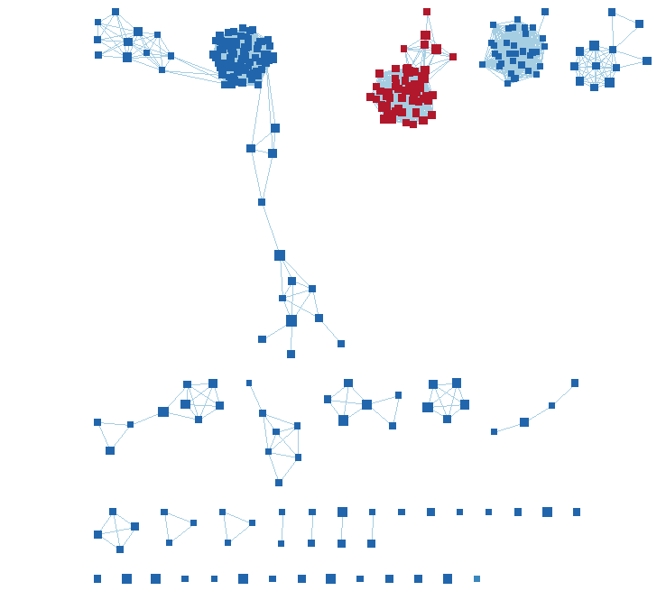
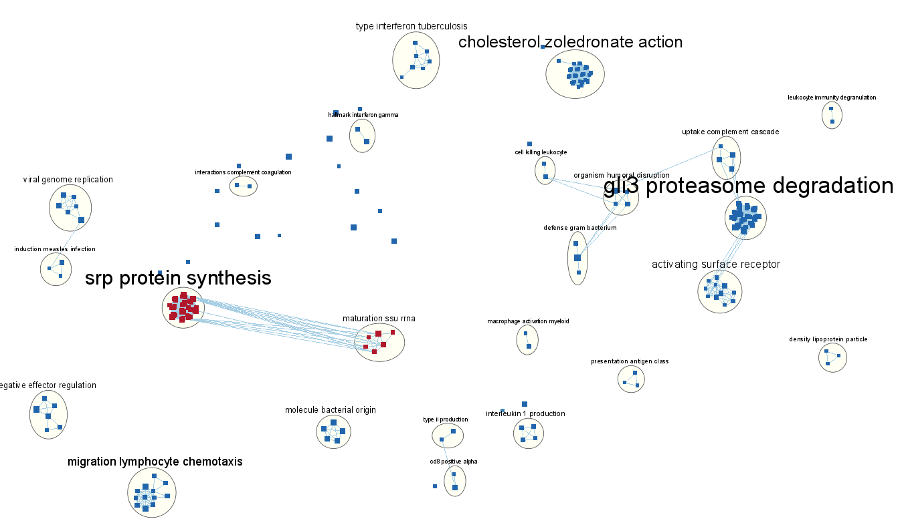
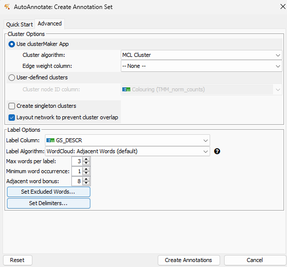
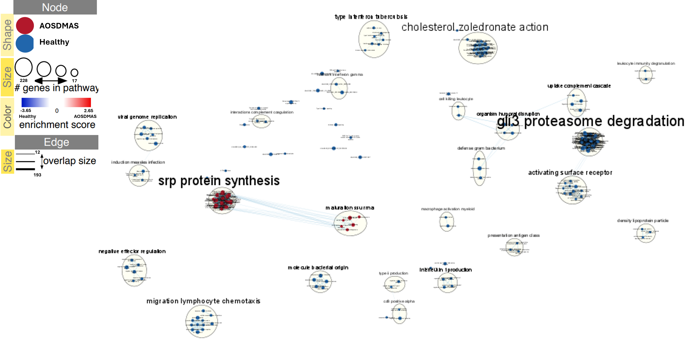
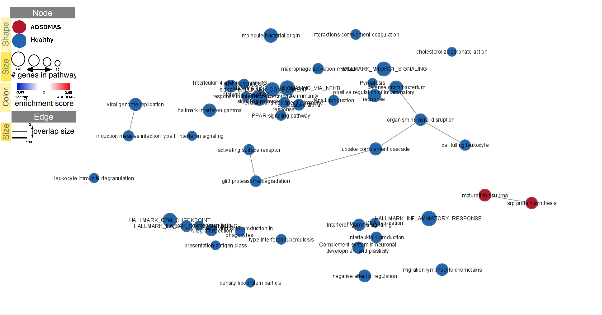
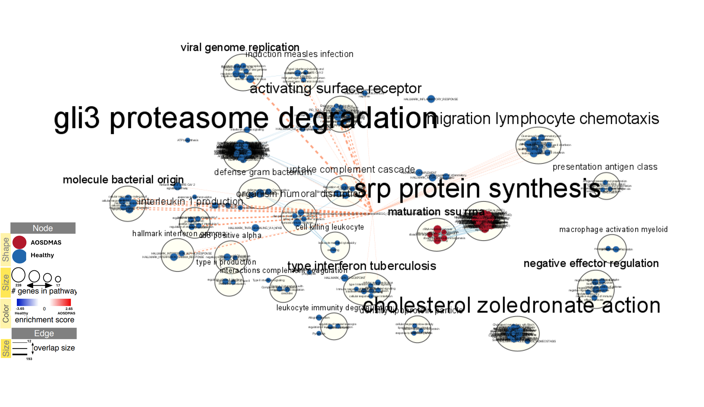

The dataset[@hu_2023_monocyte] I will be focusing on is on adult-onset Still's disease (AOSD) which is a rare autoinflammatory disease. The most serious symptom resulting from AOSD is macrophage activation syndrome (MAS). To date, there is limited research on AOSD patients with MAS and biomarkers that could be used to detect it. Thus, the study[@jia_2023_neutrophil] aims to contribute to this research area by comparing healthy controls to AOSD patients with MAS (AOSD-MAS). The dataset used is GSE247993 which was downloaded from GEO. In assignment 1, this dataset was first filtered to remove genes with low reads in which 74% of the genes survived (12404 were kept and 4280 were removed from the count data). The dataset was then normalized using TMM normalization using the edgeR package.

In the second assignment, we performed differential expression analysis on our cleaned and normalized count data using EdgeR. Then, we performed thresholded ORA through g:Profiler. Here, we will be taking the genes and ranking them based on amount of differential expression. Afterwards we will use GSEA to conduct non-thresholded enrichment analysis and visualize through Cytoscapee.


# Background

In assignment 2, we used quasi likelihood models to fit the data and QL F-test to test for differential expression

Here we will be conducting gene set enrichment analysis (GSEA) which is a non-thresholded analysis

# Install packages if neccessary
```{r message = FALSE, warning = FALSE}
if(!requireNamespace('BiocManager', quietly = TRUE)){
  install.packages('BiocManager')}

if(!requireNamespace('htmltools', quietly = TRUE)){
  install.packages('htmltools')}

if(!requireNamespace('dplyr', quietly = TRUE)){
  tidyr::install("dplyr")}

if(!requireNamespace("kableExtra", quietly = TRUE)){
  install.packages("kableExtra")}

if (!requireNamespace("fgsea", quietly = TRUE)){
  install.packages("fgsea")}

tryCatch(expr = { library("RCurl")}, 
         error = function(e) {  
           install.packages("RCurl")}, 
         finally = library("RCurl"))

if (!require("BiocManager", quietly = TRUE))
    install.packages("BiocManager")

BiocManager::install("RCy3")

tryCatch(expr = { library("httr")}, 
         error = function(e) { BiocManager::install("httr")}, 
         finally = library("httr"))

library(htmltools)
library(dplyr)
library(kableExtra)
library(fgsea)
library(RCurl)
```
Package reference: [@1],[@4],[@5],[@6],[@fgsea],[@rcurl]

# Load data
```{r message = FALSE, warning = FALSE}
load("qlf_output_hits_AOSDMAS.RData") #hits from qlf test
```


# Non-thresholded Gene set Enrichment Analysis (GSEA)

Below are the first 5 rows from the qlf test
```{r message = FALSE, warning = FALSE}
qlf_output_hits_AOSDMAS$table[1:5,]
```

Sort QLF test output by rank
```{r message = FALSE, warning = FALSE}
#Compute rank by p-value and sign
qlf_output_hits_AOSDMAS$table[,"rank"] <- -log(qlf_output_hits_AOSDMAS$table$PValue, base = 10) *sign(qlf_output_hits_AOSDMAS$table$logFC)

#Sort by ranking in descending order
ranked_hits <- as.data.frame(qlf_output_hits_AOSDMAS[order(-qlf_output_hits_AOSDMAS$table$rank),])

#See snippet of rank sorted table
ranked_hits[1:10,]

#Save ranked_hits
AOSDMAS_ranks <- cbind(rownames(ranked_hits),ranked_hits$rank)
colnames(AOSDMAS_ranks) <- c('GeneNames', 'Rank')
download_dir = file.path(getwd())

if(!file.path(download_dir,"ranked_hits.rnk")==FALSE){
  write.table(AOSDMAS_ranks, "ranked_hits.rnk",
              quote=FALSE,
              sep='\t',
              row.names=FALSE)
}


```
In order to run GSEA we must load in the Bader gene set.
```{r message = FALSE, warning = FALSE}
geneset_file = "Human_GOBP_AllPathways_withPFOCR_no_GO_iea_April_01_2024_symbol.gmt"

# Download gene set if it doesn't exist in the directory

if(!file.exists(geneset_file)){
  
  # store URL to get most recent gene set
  geneset_url = "http://download.baderlab.org/EM_Genesets/current_release/Human/symbol/"
  
  # connect to UR: and get html version of page
  filenames = getURL(geneset_url)
  tc = textConnection(filenames)
  contents = readLines(tc)
  
  # Create regular expression to get gmt with all files and not including terms from electronic annotation
  rx = gregexpr("(?<=<a href=\")(.*.GOBP_AllPathways_noPFOCR_no_GO_iea.*.)(.gmt)(?=\">)", contents,perl = TRUE)
  
  # get files that satisfy the regular expression 'rx'
  gmt_file = unlist(regmatches(contents, rx))
  
  # File path to download file
  geneset_filepath <- file.path(download_dir, gmt_file)
  
  # Download file
  download.file(paste(geneset_url, gmt_file, sep = ''), destfile = geneset_filepath)
}
```

Now, we can run GSEA. The following code is adapted from this [tutorial](https://risserlin.github.io/CBW_pathways_workshop_R_notebooks/run-gsea-from-within-r.html) 

```{r message = FALSE, warning = FALSE}
#run_gsea - true/false
# This parameter is for the compilation of the notebook.  
run_gsea <- TRUE

if(run_gsea){
  
  #Get the ranks of genes
  ranks = ranked_hits$rank
  names(ranks) = rownames(ranked_hits)
  
  #Parse geneset file and ranks into fgsea
  fgsea_output <- fgsea(pathways = fgsea::gmtPathways(geneset_filepath),
                    stats = ranks,
                    minSize = 15,
                    maxSize = 500)
}

# Check if the above worked
head(fgsea_output)
```

Next, we will create a function to reformat the fGSEA results to GSEA report files
```{r message = FALSE, warning = FALSE}
gsea_format <- function(fgsea_output, ranks){
  # find max rank
  max_rank <- apply(fgsea_output, MARGIN = 1, FUN = function(x){
    max(which(names(fgsea_output) %in% unlist(x[8])))
  })
  
  # store information in the following table that follows the format of a GSEA report file
  gsea_output = cbind(fgsea_output$pathway,
                      fgsea_output$pathway,
                      "Details ...",
                      fgsea_output$size,
                      fgsea_output$ES,
                      fgsea_output$NES,
                      fgsea_output$pval,
                      fgsea_output$padj,
                      0,
                      max_rank,
                      "Not available")
  # Rename columns
  colnames(gsea_output) <- c("name", "description", "GS DETAILS", "SIZE", "ES",
                             "NES", "pval", "padj", "FWER", "Rank at Max", 
                             "leading edge genes")
  # Return the gsea_output
  return(gsea_output)
}
```

Use the above function to store positively and negatively ranked genes to use for cytoscape in the latter portion of this assignment 
```{r, message = FALSE, warning = FALSE}
# Store the positively and negatively enriched genes and all enriched gene
pos_geneset = gsea_format(fgsea_output[fgsea_output$NES > 0],ranks)
neg_geneset = gsea_format(fgsea_output[fgsea_output$NES < 0], ranks)
enriched_geneset = gsea_format(fgsea_output, ranks)

# Save the positively and negatively enriched genes in tsv files for Cytoscape
write.table(pos_geneset,
            file = "gsea_report_for_na_pos.tsv",
            row.names = FALSE,
            quote = FALSE)
write.table(neg_geneset,
            file = "gsea_report_for_na_neg.tsv",
            row.names = FALSE,
            quote = FALSE)
```

```{r message = FALSE, warning = FALSE}
fgsea_output[NES > 0][order(fgsea_output[NES > 0]$padj), ][1:20, c("pathway", "padj")] %>% kable(caption = 'Table 1. Top 20 enriched upregulated gene sets in AOSDMAS patients', digits = 30) %>% kable_styling(bootstrap_options = c("striped", "hover", "responsive"))
```
A snippet of Table 1. shows that mostly genes related to RNA processing and protein synthesis are enriched in AOSDMAS patients. 

```{r message = FALSE, warning = FALSE}
fgsea_output[NES < 0][order(fgsea_output[NES < 0]$padj), ][1:25, c("pathway", "padj")] %>% kable(caption = 'Table 2. Top 20 enriched downregulated gene sets in healthy patients', digits = 30) %>% kable_styling(bootstrap_options = c("striped", "hover", "responsive"))
```
Table 2. shows that in healthy patients, most of the enriched genes are related to the immune system.
## Questions
1. What method did you use? What genesets did you use? Make sure to specify versions and cite your methods.
I used the fgsea R package [@10] to conduct the non-thresholded analysis using the GSEA v4.3.3 [@Subramanian2005-fy]. 

`Human_GOBP_AllPathways_noPFOCR_no_GO_iea_April_01_2024_symbol.gmt` gene set was used from the Bader lab that I downloaded through R.  


2. Summarize your enrichment results.
```{r message = FALSE, warning = FALSE}
AOSDMAS_gs <- nrow(fgsea_output)
AOSDMAS_enriched <- nrow(fgsea_output[NES > 0])
AOSDMAS_signif <- nrow(fgsea_output[NES > 0][padj < 0.05])

healthy_enriched <- nrow(fgsea_output[NES < 0])
healthy_signif <- nrow(fgsea_output[NES < 0][padj < 0.05])

group <- c('AOSDMAS', 'Healthy')
enrich <- c(AOSDMAS_enriched,healthy_enriched)
signif <- c(AOSDMAS_signif, healthy_signif)

tabl <- data.frame(cbind(group, enrich, signif))
colnames(tabl) <- c('Group', 'Number of enriched genesets', 'Number of significant genesets')

```

There were  `r AOSDMAS_gs` number of genesets in total from GSEA anlysis. 
```{r message = FALSE, warning = FALSE}
tabl %>% kable(caption = 'Table 4. Summary of enrichment data', digits = 30) %>% kable_styling(bootstrap_options = c("striped", "hover", "responsive"))
```


3. How do these results compare to the results from the thresholded analysis in Assignment #2. Compare qualitatively. Is this a straight forward comparison? Why or why not?

In the ORA we saw that in AOSDMAS patients, there were many genes sets related to the immune system or reactions which agrees with our results in here using non-thresholded analysis. In both ORA and GSEA, we also see that pathways related to protein polymerization were also upregulated in AOSDMAS patients. However, we see more terms related to antigen presentation in ORA compared to GSEA. All together, these results also agree with the biological themes brought up in the original paper. 

The comparison however, may not be so straightforward because they fundamentally use different pathways to analyze the genes. Also, in thresholded analysis, there is information that might have been lost because of the nature of providing a threholded for genesets.

# Visualize GSEA in Cytoscape

1. Create an enrichment map - how many nodes and how many edges in the resulting map? What thresholds were used to create this map? Make sure to record all thresholds. Include a screenshot of your network prior to manual layout.

1020 nodes
10952 edges
Node cutoff = 0.1
Edge cutoff = 0.375
P-value = 1.0
FDR Q-value = 0.001


Figure 1. Enrichment map of genes before manual layout

2. Annotate your network - what parameters did you use to annotate the network. If you are using the default parameters make sure to list them as well.


Figure 2. Annotated enrichment map

I selected the 'Layout network to prevent cluster overlap' option. I kept all other default settings as shown below:
- Cluster algorithm = MCL Cluster
- Edge weight column - None


Figure 3. Settings used to annotate enrichment map

3. Make a publication ready figure - include this figure with proper legends in your notebook.

Figure 4.Enrichment map of gene sets from AOSDMAS patients compared to healthy patients analyzed by GSEA. Red nodes represents genesets that were enriched in AOSDMAS patients and blue represents genesets enriched in healthy patients.

4. Collapse your network to a theme network. What are the major themes present in this analysis? Do they fit with the model? Are there any novel pathways or themes?


Figure 5. Collapsed enrichment map showing major biological themes.

From Figure 5. we again see many enriched genes in healthy patients that are related to inflammation responses, which are the blue nodes. We also see on the right of Figure 5, two major themes that we see in the GSEA analysis where pathways related to RNA processing and protein synthesis is enriched in AOSDMAS patients.


# Interpretation
1. Do the enrichment results support conclusions or mechanism discussed in the original paper? How do these results differ from the results you got from Assignment #2 thresholded methods

In the paper, they studied the most serior complication of AOSD which is macrophage activation syndrome that is initated by the activation of immune system and a cytokine storm. As mentioned previously, we have seen in both the ORA and GSEA that pathways related to immune system activation is enriched and upregulated in patients with AOSDMAS which supports the mechanism discussed in the paper. I also saw that in our enrichment analyses that surface markers of monocytes were enriched which is also found in the paper. These surface markers have costimulatory behaviour that enhances each other's activities and are mostly found on intermediate monocytes.  

In the paper's GO enrichment analysis, they revealed genes that were enriched in the AOSDMAS group which are involved in defense response to virus and cytokine-mediated signalling pathways which agrees with the results in this analysis and analysis from assignment 2. One difference is in the paper, there were pathways related to nuclear division that were enriched in AOSDMAS patients whereas my results did not show that. 

Unfortunately, the paper did not report genes that were downregulated so I am not able to compare this portion of the results.

2. Can you find evidence, i.e. publications, to support some of the results that you see. How does this evidence support your result?

Yes, there has been many sources of evidence showing the role of the innate system activation during the pathogenesis of AOSD. One publication has shown that macrophages and neutrophils initate and facilitate inflammation in patients with AOSD. [@wang_2019_pathogenesis] Another group has also shown that the activated monocytes migrate and accumulate in tissues and differentiate into pro-inflammatory macrophages. [@billiau_2005_macrophage] These publications further support the findings in this assignment that the there is an increased immune response associated with activated monocytes in AOSD patients with and without MAS.

# Post Analysis

I chose to use the `REACTOME_THE_NLRP3_INFLAMMASOME` gene set which can be downloaded [here](https://www.gsea-msigdb.org/gsea/msigdb/cards/REACTOME_THE_NLRP3_INFLAMMASOME)

This analysis was chosen because there were in-vitro experiments in the paper that provided evidence that the DNA-sensing pathway was upregulated in monocytes derived from AOSD-MAS and furthermore it was previously shown that NETs-DNA from AOSD patients activated macrophages and it was hypothesized to be via activation of the NLRP3 inflammasome.[@hu_2019_increased] After post-analysis, we do in fact see relationships between NLR3P gene set and gene sets related to inflammation which probably do lead to macrophage activation.


Figure 6. Post-analysis of enrichment map using NLRP3 inflammasome gene set.

